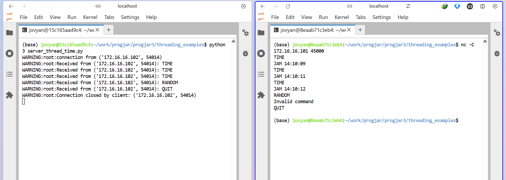

# Tugas 2 Pemrograman Jaringan

| Name           | NRP        | Kelas     | 
| ---            | ---        | ----------| 
| Algof Kristian Zega | 5025231235 | Pemrograman Jaringan (D) |

## Soal Program Time Server

## Spesifikasi Program

### a. Transport dan Port
- Menggunakan protokol **TCP**
- Membuka koneksi pada **port 45000**

### b. Concurrency
- Server harus dapat menangani banyak client secara **concurrent** menggunakan **multithreading**

### c. Format Request yang Dilayani
1. Request **harus diawali** dengan string `"TIME"`  
2. **Diakhiri** dengan karakter **`carriage return (CR - 13)` dan `line feed (LF - 10)`**, yaitu `\r\n`  
3. Client dapat mengakhiri koneksi dengan string: `QUIT\r\n`

### d. Format Response dari Server
- Response dikirim dalam bentuk **string (UTF-8)**
- Format: `JAM<spasi><jam>`
- `<jam>` berupa waktu saat ini dengan format **`hh:mm:ss`**

### Catatan:

Untuk mendapatkan waktu sekarang dapat menggunakan contoh berikut:
```py
from datetime import datetime
now = datetime.now()
waktu = now.strftime("%d %m %Y %H:%M:%S")
```

## Jalankan di lab environment
- Tuliskan dalam satu file PDF dengan nama TUGAS2.PDF
- Link menuju source code anda di github (masing-masing harus punya repository di github)
- Capturelah hasil eksekusi program server anda
- Semua poin, harus dilengkapi dengan deskripsi dan penjelasan minimum 50 kata

